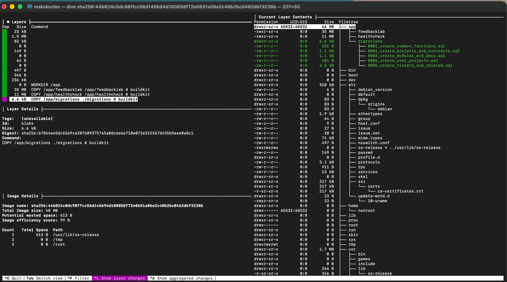

# 1 Поднятие окружение
## 1.1 Подготовка окружения
- Убедись, что рядом с Dockerfile лежат файлы: `Dockerfile
docker-compose.local.yml
.env.docker
.dockerignore
migrations/
go.mod / go.sum
cmd/server/main.go`

## 1.2 Прокинь .env.docker файл

## 1.3 Поднятие docker compose
- Собери и запусти сервисы:
`docker compose -f docker-compose.local.yml up --build`

## 1.4. Проверка доступности
`curl http://localhost:8080/api/health`
Ожидаемый ответ:
`{"status":"ok"}`

## 1.5 Полезные команды к docker

| Действие                             | Команда                                                    |
|--------------------------------------|------------------------------------------------------------|
| **Запустить**                        | `docker compose -f docker-compose.local.yml up -d`         |
| **Пересобрать**                      | `docker compose -f docker-compose.local.yml up --build`    |
| **Остановить**                       | `docker compose -f docker-compose.local.yml down`          |
| **Удалить контейнеры и volume (БД)** | `docker compose -f docker-compose.local.yml down -v`       |
| **Посмотреть логи**                  | `docker compose -f docker-compose.local.yml logs -f app`   |
| **Зайти внутрь контейнера API**      | `docker exec -it innotech_app sh`                          |
| **Зайти в PostgreSQL**               | `docker exec -it innotech_db psql -U feedback -d innotech` |
| **Провести анализ через dive**       | `dive sha256:код image`                                    |

## 1.5 Swagger:
Swagger доступен по ссылке: `http://localhost:8080/swagger/index.html#/`

## 1.6 Dive analyze:
